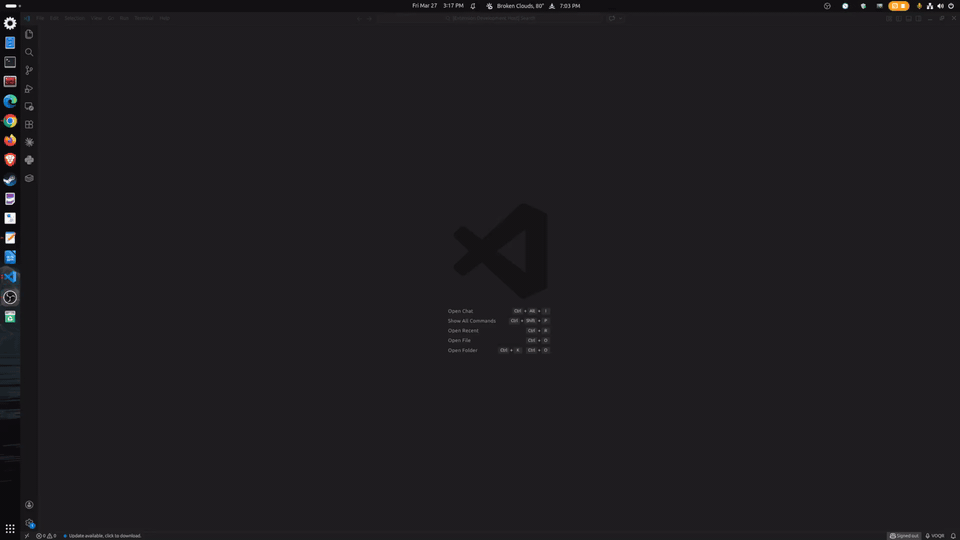

# VOQR — Voice for AI Chat

**Talk to any AI. Hear every answer. Local. Private. Yours.**

> *(rhymes with "poker")*



*Click to talk. AI responds by voice. All local.* [Watch with audio →](https://youtu.be/YPq_U5BSbj4)

VOQR adds voice interaction to every AI chat provider in VS Code. Speech-to-text and text-to-speech run entirely on your machine — your voice data never leaves your computer.

## Features

- **Universal** — works with Copilot, HuggingFace, AI Toolkit, and any provider that properly supports the VS Code Language Model API
- **Local & private** — STT (Whisper) and TTS (Kokoro) run on your hardware. No cloud. No telemetry
- **Streaming responses** — hear AI responses sentence-by-sentence as they generate, not after a long wait
- **Push-to-talk or hands-free** — toggle between manual and voice-activated modes
- **Smart text normalization** — AI responses full of markdown, code blocks, and URLs are cleaned up for natural speech
- **Setup wizard** — guided onboarding walks you through installing and configuring your first AI provider
- **Customizable** — adjust speech speed, mute/unmute TTS, choose your AI model

## Quick Start

1. **Install VOQR** from the VS Code Marketplace
2. **Click the mic button** in the status bar (or use your platform's keybinding — see [Keybindings](#keybindings))
3. **Pick an AI provider** — the setup wizard will guide you if you don't have one installed
4. **Talk** — VOQR transcribes your speech, sends it to your AI, and reads the response aloud

That's it. No API keys for VOQR, no accounts, no configuration required.

## Supported Providers

VOQR works with any AI provider that properly implements the [VS Code Language Model API](https://code.visualstudio.com/api/extension-guides/language-model):

| Provider | Cost | Setup | Wizard |
|----------|------|-------|--------|
| **GitHub Copilot** | Free tier (50 msgs/mo) | Install extension + GitHub sign-in | Guided |
| **HuggingFace** | Free tier available | Install extension + API token | Guided |
| **AI Toolkit** | Free (GitHub Models + local) | Install extension | Guided |
| **Cerebras** | Free tier available | Install extension + API key | Manual — Cerebras extension does not activate reliably |
| **OpenAI Compatible** | Varies | Install extension + endpoint config | Manual — OAICopilot extension has unresolved configuration issues |

The built-in setup wizard walks you through each guided provider step by step. Manual providers work with VOQR but require independent configuration — VOQR will detect them automatically once set up.

## Requirements

| Component | Details |
|-----------|---------|
| **VS Code** | 1.99.0 or later |
| **OS** | Linux, Windows, macOS |
| **STT** | whisper.cpp (auto-detected, or specify path in settings) |
| **TTS** | Python 3.10–3.13 + Kokoro (auto-installed on first use) |

VOQR auto-detects whisper.cpp and Python on your system. If they're not found, you'll be prompted to configure the paths in settings.

## Keybindings

| Action | Linux | Windows | macOS |
|--------|-------|---------|-------|
| Push to Talk | `Ctrl+Shift+Space` | `Ctrl+F9` | `Cmd+Shift+Space` |
| Toggle Voice Panel | `Ctrl+Shift+V` | `Ctrl+Shift+V` | `Cmd+Shift+V` |

The **status bar mic button** is always available as an alternative — no keybinding needed.

## Settings

| Setting | Default | Description |
|---------|---------|-------------|
| `voqr.inputMode` | `pushToTalk` | `pushToTalk` or `voiceActivity` (hands-free) |
| `voqr.ttsSpeed` | `1.0` | Speech speed (0.5× – 2.0×) |
| `voqr.ttsAutoPlay` | `true` | Automatically speak AI responses |
| `voqr.sttBackend` | `auto` | `auto` (whisper.cpp), `faster-whisper` (GPU), or `external` |
| `voqr.sttModelSize` | `tiny` | Whisper model: `tiny`, `base`, `small`, `medium` |
| `voqr.debug` | `false` | Verbose logging to output channel |

Quick controls for speed and mute are also available directly in the VOQR panel.

## Privacy

VOQR processes all voice data locally:

- **Speech-to-text:** whisper.cpp runs on your CPU — audio never leaves your machine
- **Text-to-speech:** Kokoro TTS runs on your CPU — no cloud synthesis
- **No telemetry:** VOQR collects zero usage data
- **No account required:** Free tier works without sign-up

For a voice extension, *"we collect no data"* is a feature, not a gap.

## How It Works

```
You speak → Mic capture → Voice activity detection (Silero VAD)
→ Speech-to-text (whisper.cpp) → AI model (your chosen provider)
→ Streaming response → Text normalization → Text-to-speech (Kokoro)
→ You hear the answer — sentence by sentence, as it generates
```

## Comparison

| | VOQR | VS Code Speech | Wispr Flow | Superwhisper |
|---|---|---|---|---|
| Local STT | Yes | Yes | No (cloud) | Yes |
| Local TTS | Yes | Limited | No | No |
| Any AI provider | Yes | Yes | Any text field | Any text field |
| VS Code native | Yes | Yes | No (system-level) | No (system-level) |
| Custom voice | Yes | No | No | No |
| Speaker ID | Coming Soon | No | No | No |
| Offline capable | Yes | Yes | No | Yes (STT only) |
| Price | Free | Free | Free / $15/mo | $8.49/mo |

## What's Next

- **v0.4** — Zero-config: bundled STT and TTS, no external server setup required
- **v1.0** — Pro features: speaker verification, custom voice blending, voice commands, audio + text sync with pause/resume

Follow development at [github.com/InterGenJLU/voqr-public](https://github.com/InterGenJLU/voqr-public).

## Contributing

VOQR is MIT licensed. Issues, feature requests, and voice quality reports welcome:

- [Bug Report](https://github.com/InterGenJLU/voqr-public/issues/new?template=bug_report.md)
- [Feature Request](https://github.com/InterGenJLU/voqr-public/issues/new?template=feature_request.md)
- [Voice Quality Report](https://github.com/InterGenJLU/voqr-public/issues/new?template=voice_quality.md)

## License

MIT — see [LICENSE](LICENSE).

Open-source attributions: [ATTRIBUTIONS.md](ATTRIBUTIONS.md).

---

*VOQR is an independent project and is not affiliated with, endorsed by, or sponsored by any AI provider. All product names, trademarks, and registered trademarks are property of their respective owners.*
